Navier-Stokes Cahn-Hilliard (NSCH) for MOOSE Framework
=====

The MOOSE Navier-Stokes Cahn-Hilliard (NSCH) application is a library for implementing simulation tools that solve the Navier-Stokes Cahn-Hilliard equations with non-matching densities using Galerkin finite element methods with a residual-based stabilization scheme.

## Navier-Stokes Cahn-Hilliard (NSCH) equations

The Navier-Stokes Cahn-Hilliard (NSCH) equations describe the behavior of two-phase fluid flow with non-matching densities. These equations combine the Navier-Stokes equations, which govern the motion of viscous fluid substances, with the Cahn-Hilliard equation, which models phase separation and interfacial dynamics. The NSCH equations are particularly useful for simulating complex fluid interactions where the densities of the two phases are different, such as in multiphase flows with oil and water. The equations account for the conservation of mass, momentum, and the phase field variable, providing a comprehensive framework for studying the dynamics of immiscible fluids. 

For more information, please see the [theory page](doc/Theory.md) 

## MOOSE Framework

The Multiphysics Object-Oriented Simulation Environment (MOOSE) is a finite-element, multiphysics framework primarily developed by [Idaho National Laboratory](https://inl.gov/). It provides a high-level interface to some of the most sophisticated nonlinear solver technology on the planet. MOOSE presents a straightforward API that aligns well with the real-world problems scientists and engineers need to tackle. Every detail about how an engineer interacts with MOOSE has been thought through, from the installation process through running your simulation on state of the art supercomputers, the MOOSE system will accelerate your research.

Some of the capabilities enabled by MOOSE:

- Fully-coupled, fully-implicit multiphysics solver
- Dimension independent physics
- Automatically parallel (largest runs >100,000 CPU cores!)
- Modular development simplifies code reuse
- Built-in mesh adaptivity
- Continuous and Discontinuous Galerkin (DG) (at the same time!)
- Intuitive parallel multiscale solves (see videos below)
- Dimension agnostic, parallel geometric search (for contact-related applications)
- Flexible, pluggable graphical user interface
- Approximately 30 pluggable interfaces allow specialization of every part of the solve

For more information, please see the official [MOOSE website](https://mooseframework.inl.gov).

# Tutorial

## Install MOOSE on HPC Cluster
1. Load required modules on the cluster:

    ```bash
    module load gcc/10.2.0 openmpi/4.0.5-gcc10.2.0
    module load anaconda3/2020.11
    ```

2. Cloning MOOSE

    MOOSE is hosted on [GitHub](https://github.com/idaholab/moose) and should be cloned directly from there using [git](https://git-scm.com/). We recommend creating a projects directory to contain all of your MOOSE related work. To clone MOOSE, run the following commands in a terminal:

    ```bash
    mkdir -p ~/projects
    cd ~/projects
    git clone https://github.com/idaholab/moose.git
    cd moose
    git checkout master
    ```

3. PETSc, libMesh, and WASP

    MOOSE requires several support libraries in order to build or run properly. These libraries (PETSc, libMesh, and WASP) can be built using our supplied scripts:
    cd ~/projects/moose/scripts
    ```bash
    export MOOSE_JOBS=6 METHODS=opt
    ./update_and_rebuild_petsc.sh   || return
    ./update_and_rebuild_libmesh.sh  || return
    ./update_and_rebuild_wasp.sh  || return
    ```

4. Build and Test MOOSE

    To build MOOSE, run the following commands:

    ```bash
    cd ~/projects/moose/test
    make -j 6
    ```

    To test MOOSE, run the following commands:

    ```bash
    cd ~/projects/moose/test
    ./run_tests -j 6
    ```

    Some tests are SKIPPED. This is normal as some tests are specific to available resources, or some other constraint your machine does not satisfy.

## Install NSCH Application

1. Clone the NSCH-MOOSE repository under the MOOSE directory:

    ```bash
    cd ~/projects
    git clone https://github.com/Silverwing747/nsch-moose.git
    cd nsch-moose
    ```

2. Build and Execute the NSCH Application:

    To build the NSCH Application, run the following commands:

    ```bash
    cd ~/projects/nsch-moose
    make -j 6
    ```

    This will generate an executable file `nsch-moose-opt` under the directory `~/projects/nsch-moose`.

    You can now execute the program using:

    ```bash
    mpiexec -n N ./nsch-moose-opt -i InputFileName
    ```

    where `N` is the number of cores, and `InputFileName` is the path to the input file specified by the user. For more details about the input file, refer to the [MOOSE Input File Document](https://mooseframework.inl.gov/modules/thermal_hydraulics/tutorials/basics/input_file.html).

## Test NSCH Application

The NSCH application is designed to allow users to easily couple and decouple the Navier-Stokes and Cahn-Hilliard functionalities. This modular approach enables users to test each subsystem independently, ensuring that each part of the implementation is functioning correctly before combining them for more complex simulations.

### Test Navier-Stokes Subsection

To verify the implementation of the Navier-Stokes equations, two benchmark problems are provided:

1. **Taylor-Green Vortex**: This benchmark problem is a well-known analytical solution for the Navier-Stokes equations. It involves a decaying vortex and is used to test the accuracy and stability of the numerical methods in the NSCH application. 
    
    The input file for this test case is [test/tests/navier_stokes/TaylorGreenVortex.i](test/tests/navier_stokes/TaylorGreenVortex.i). 

    The initial condition is shown below:
    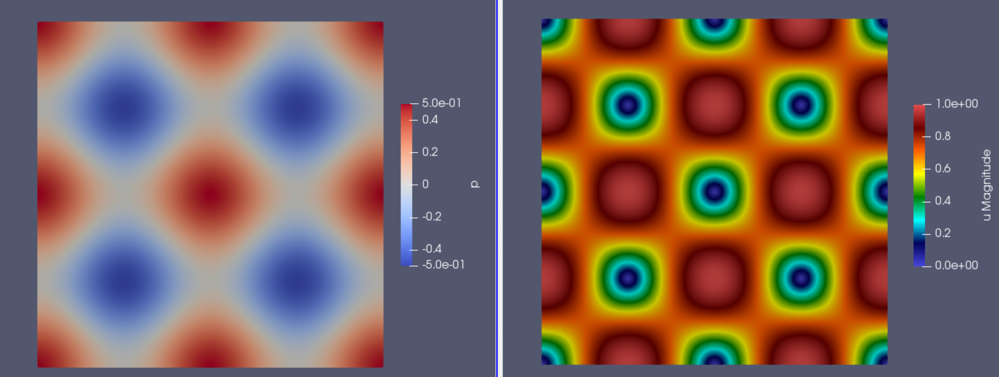

    The solution at the final time step ($t = 1.0$) is shown below:
    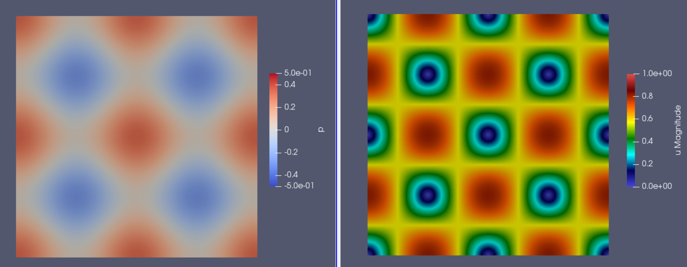

2. **Lid-Driven Cavity**: This benchmark problem involves a square cavity with a moving lid, generating a recirculating flow inside the cavity. It is commonly used to test the performance of numerical solvers for incompressible flows and to validate the implementation of boundary conditions. 

    The input file for this test case is [test/tests/navier_stokes/LidDrivenCavity.i](test/tests/navier_stokes/LidDrivenCavity.i). 

    Once the vortex is developed, the velocity megnitude field should look like this:
    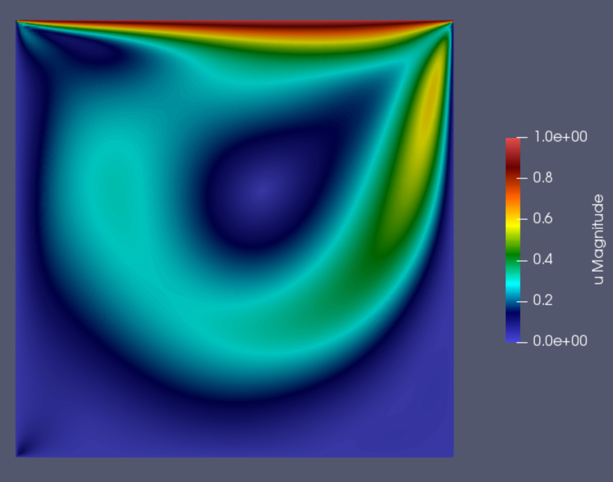


These test cases help ensure that the Navier-Stokes solver in the NSCH application is correctly implemented and capable of handling different types of fluid flow problems. 

### Test Cahn-Hilliard Subsection

To verify the implementation of the Cahn-Hilliard equation, we use the **Spinodal Decomposition** problem. Spinodal decomposition is a process where a homogeneous mixture of two components separates into distinct regions with different compositions. This phenomenon occurs when the mixture is quenched into an unstable region of its phase diagram, leading to spontaneous phase separation. The spinodal decomposition test involves initializing the system with a small random perturbation around a homogeneous state. Over time, the system evolves, and distinct phases form, characterized by regions rich in one component and regions rich in the other. This test is useful for validating the accuracy and stability of the Cahn-Hilliard solver, as well as its ability to capture the dynamics of phase separation.

The input file for this test case is [test/tests/cahn_hilliard/SpinodalDecomposition.i](test/tests/cahn_hilliard/SpinodalDecomposition.i).

The initial condition is shown below:
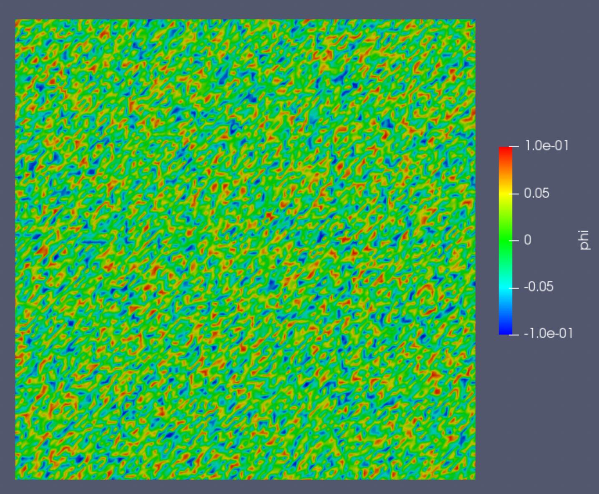

The solution at an intermediate time step, showing the beginning of phase separation, is shown below:
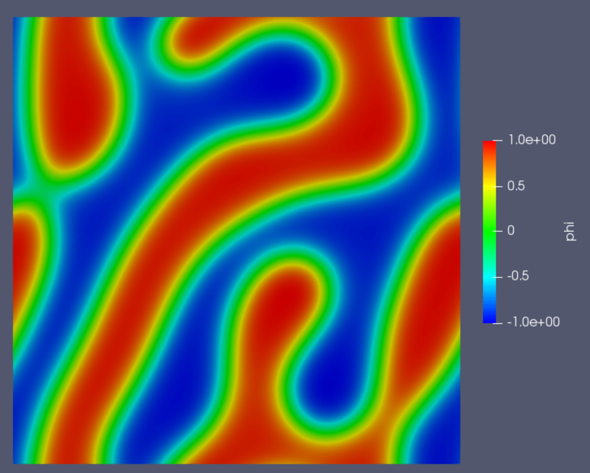

The solution at a later time step, showing the phase separation nearing equilibrium, is shown below:
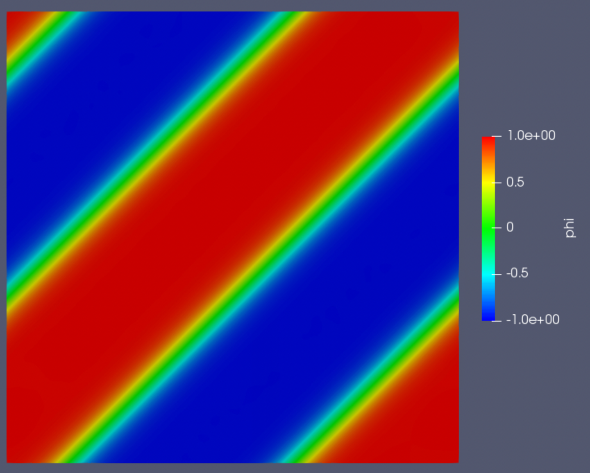

These images illustrate the progression of the spinodal decomposition process, from the initial homogeneous state, through the early stages of phase separation, to the final equilibrium state where distinct phases are fully developed.

This test case helps ensure that the Cahn-Hilliard solver in the NSCH application is correctly implemented and capable of simulating phase separation processes.

## Numerical Example of NSCH Application

Once each subcomponent is verified, we can use NSCH to solve problems of interest. Here we present two cases: (1) a heavy fluid immersed in light fluid and dropping due to gravity, and (2) Rayleigh-Taylor instability.

### Case 1: Heavy Fluid Dropping Due to Gravity

In this example, we simulate a scenario where a heavy fluid droplet is immersed in a lighter fluid and allowed to fall under the influence of gravity. This setup is useful for studying the dynamics of fluid interfaces and the effects of density differences on fluid motion.

The input file for this test case is [examples/DroppingBubble/DroppingBubble.i](examples/DroppingBubble/DroppingBubble.i).

The input file with adaptive mesh functionality is [examples/DroppingBubble/DroppingBubble_Adaptive.i](examples/DroppingBubble/DroppingBubble_Adaptive.i).

The initial condition is shown below:
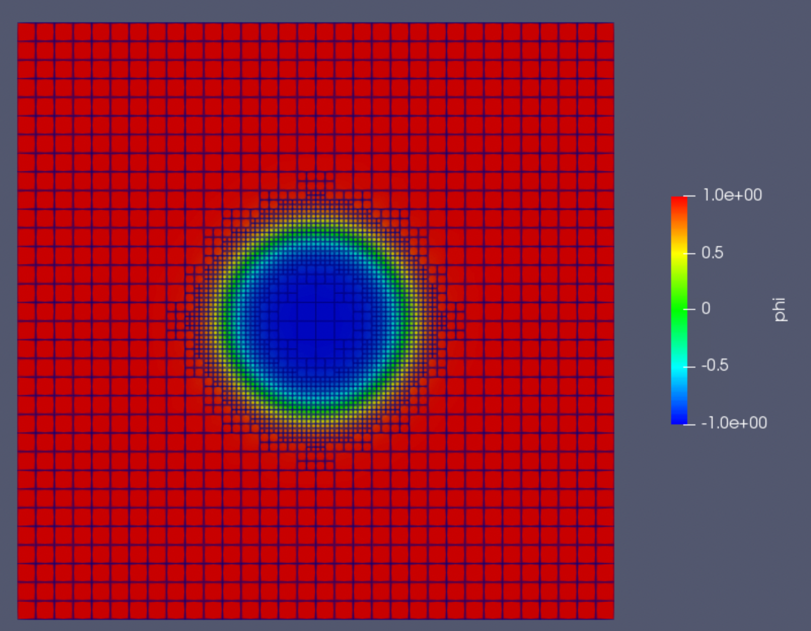

As the simulation progresses, the heavy fluid droplet accelerates downward due to gravity, deforming the interface between the two fluids. The solution at an intermediate time step is shown below:
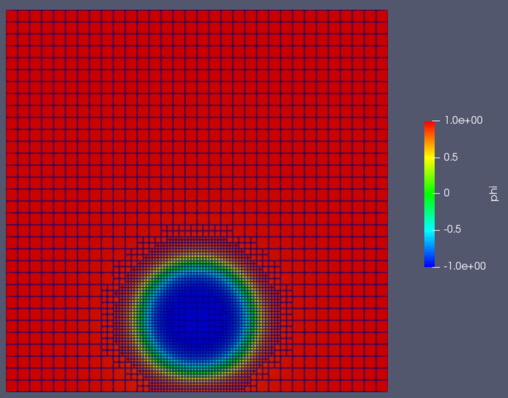

As the heavy fluid droplet reaches the bottom wall, it experiences a series of oscillations due to the interplay between gravitational forces and surface tension. These oscillations gradually diminish as the system approaches an equilibrium state. The final configuration demonstrates the droplet's attachment to the bottom wall, where it stabilizes after the oscillatory motion ceases. This behavior is indicative of the complex fluid dynamics captured by the NSCH application, showcasing its ability to simulate the interactions and stabilization processes of immiscible fluids with different densities.

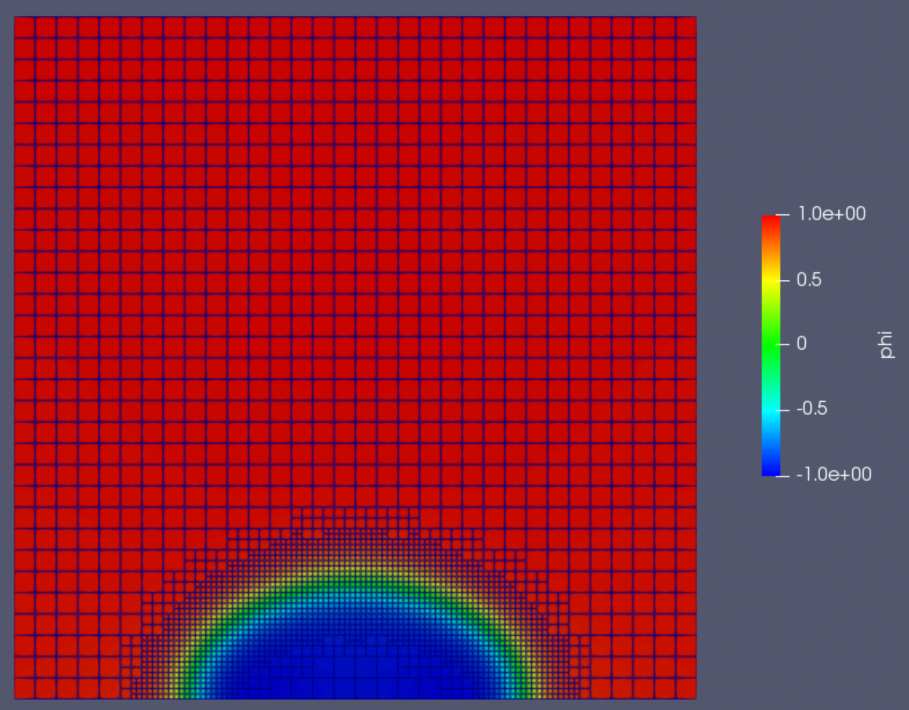

This example demonstrates the capability of the NSCH application to handle complex fluid interactions and accurately capture the dynamics of immiscible fluids with different densities.

### Case 2: Rayleigh-Taylor Instability

The Rayleigh-Taylor instability occurs when a denser fluid is placed above a lighter fluid in the presence of a gravitational field. This configuration is unstable, and any small perturbation at the interface will grow over time, leading to the formation of complex flow patterns. This phenomenon is commonly observed in various natural and industrial processes, such as in astrophysics, geophysics, and fluid mixing.

The input file for this test case is [examples/RayleighTaylor/RayleighTaylor.i](examples/RayleighTaylor/RayleighTaylor.i).

The input file with adaptive mesh functionality is [examples/RayleighTaylor/RayleighTaylor_Adaptive.i](examples/RayleighTaylor/RayleighTaylor_Adaptive.i).

The initial condition is shown below:
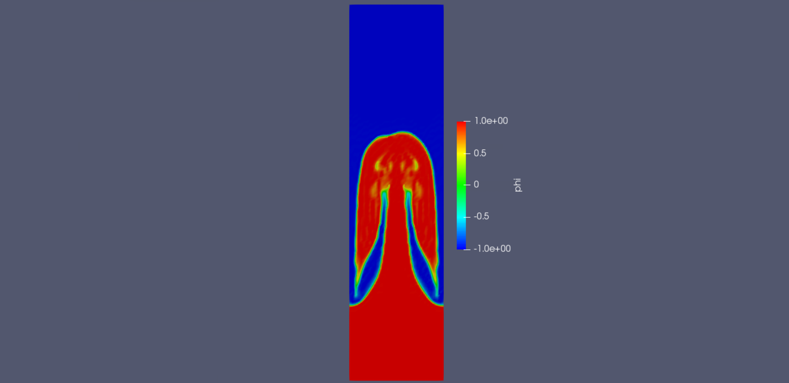

In the initial condition, the denser fluid is positioned above the lighter fluid, creating a gravitationally unstable configuration. The interface between the two fluids is initially flat, but small perturbations are present, which will grow over time due to the instability.

As the simulation progresses, the perturbations at the interface grow, leading to the development of finger-like structures. These structures are characteristic of the Rayleigh-Taylor instability, where the denser fluid moves downward into the lighter fluid, and the lighter fluid rises into the denser fluid. At this intermediate stage, the finger-like structures have become more pronounced, and the interface between the two fluids has become highly irregular. The denser fluid continues to penetrate downward, while the lighter fluid rises, creating complex flow patterns and mixing between the two fluids. The solutions at an intermediate time step are shown below:
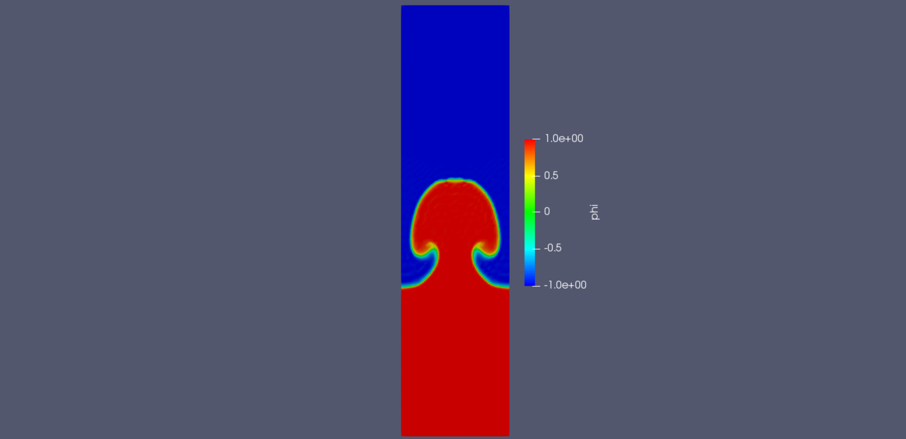


This example highlights the ability of the NSCH application to simulate instabilities and capture the intricate details of fluid interface dynamics.

These numerical examples illustrate the versatility and robustness of the NSCH application in handling a wide range of fluid flow problems involving complex interactions between immiscible fluids with different densities.